# Optimización del Route to Market en el sector tabacalero

**Business Intelligence y analítica predictiva aplicada a Altadis España (Imperial Brands Group)**

Trabajo Fin de Máster — Máster Universitario en Business Intelligence, UNIR.
Proyecto desarrollado en colaboración con Altadis, S.A. — **Imperial Brands Group** | Red Proyectium.


[`TFM_Final_CarlosBaztánPeiró.pdf`](TFM_Final_CarlosBaztánPeiró.pdf)

## Autoría

Trabajo Fin de Máster, dirigido por Enrique Hortalá González. 
Este repositorio recoge y documenta la parte técnica del proyecto | modelado de datos, SQL, notebooks de Python y dashboard de Power BI | como parte del portfolio personal de **Carlos Baztán Peiró**.

## Contexto

El sector tabacalero español opera bajo presión regulatoria creciente, cambios en los hábitos de consumo y una red de distribución compleja basada en estancos. Altadis puso a disposición del proyecto datos operacionales anonimizados de 2015 (ventas, entregas, roturas de stock y rutas de reparto) con el objetivo de transformar esa información dispersa en una base analítica única que soporte decisiones comerciales, logísticas y estratégicas.

## Objetivos del proyecto

1. Auditar la calidad, consistencia y fiabilidad de los datos operacionales disponibles.
2. Diseñar e implementar un Data Warehouse (esquema en estrella) que integre los datos internos con fuentes externas (INE, BOE).
3. Construir un sistema de visualización e indicadores de negocio (dashboard Power BI).
4. Aplicar analítica avanzada: segmentación de puntos de venta (clustering) y predicción de rotura de stock.

## Arquitectura de datos

Metodología CRISP-DM + modelado dimensional (Kimball). Punto de partida: 6 ficheros de Altadis (~2,1M registros, en [`data/raw/`](data/raw/)) enriquecidos con provincia y renta media neta por persona por provincia (INE, a partir del código postal) y calendario de festivos por CCAA (BOE), materializados en un esquema en estrella sobre SQL Server.

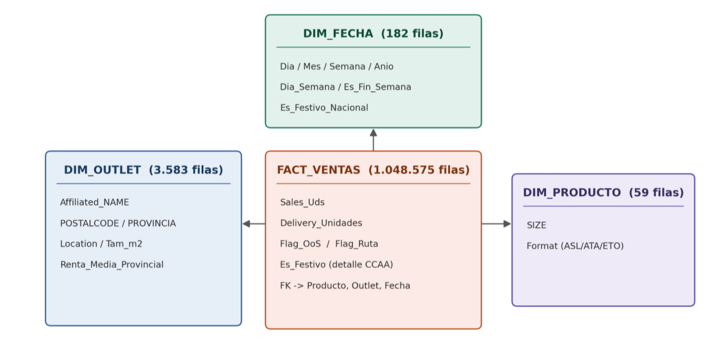

| Tabla | Filas | Rol |
|---|---|---|
| `FACT_Ventas` | 1.048.575 | Tabla de hechos: una fila por venta (outlet + producto + día), con métricas de entrega, rotura de stock, ruta y festivo (detalle autonómico) |
| `DIM_Outlet` | 3.583 | Estancos, con provincia y renta media neta por persona (INE), derivadas del código postal |
| `DIM_Producto` | 59 | Catálogo de productos (formato ASL/ATA/ETO) |
| `DIM_Fecha` | 182 | Calendario diario de la ventana real de venta, con indicador de festivo nacional (BOE) |

El proceso completo (staging, resolución de duplicados, cálculo de columnas derivadas, materialización del esquema) está documentado en [`sql/`](sql/). El festivo es el único atributo que no puede fijarse en `DIM_Fecha`: al depender a la vez de la fecha y de la Comunidad Autónoma del outlet, el detalle autonómico se resuelve cruzando fecha × provincia a nivel de `FACT_Ventas`, mientras que `DIM_Fecha` conserva solo el indicador de festivo nacional.

## Estructura del repositorio

```
├── docs/
│   └── TFM_Memoria.pdf          # Memoria completa del TFM (78 págs.)
├── data/
│   ├── README.md                 # Diccionario de datos
│   └── raw/                      # Datos operacionales de Altadis 2015 (anonimizados)
├── sql/                          # Construcción del Data Warehouse en SQL Server
├── notebooks/                    # Modelos de Python (clustering + predicción)
├── dashboard/
│   └── TFM_PBI.pbix              # Cuadro de mando Power BI (4 páginas)
└── assets/figures/                # Gráficos generados en el análisis
```

## Ejemplos de SQL

El proceso completo de construcción del Data Warehouse está documentado en [`sql/`](sql/); aquí unos fragmentos representativos del trabajo de modelado y limpieza.

### Enriquecimiento geográfico: código postal → provincia

Los estancos solo traían código postal. Los dos primeros dígitos coinciden con el CPRO (código de provincia) del INE, así que se cruzó contra el callejero de municipios del INE para obtener la provincia de cada outlet:

```sql
-- Los primeros 2 dígitos del POSTALCODE coinciden con el CPRO del INE
--   POSTALCODE = '28015' → CPRO = '28' → Madrid
--   POSTALCODE = '08940' → CPRO = '08' → Barcelona

CREATE VIEW v_outlets_provincia AS
SELECT
    a.Affiliated_Code,
    a.Affiliated_NAME,
    a.POSTALCODE,
    a.CPRO,
    p.PROVINCIA,
    a.Engage,
    a.Management_Cluster,
    a.Location,
    a.Tam_m2
FROM affiliated_outlets a
LEFT JOIN provincias p ON a.CPRO = p.CPRO;
```

### Festivo nacional vs. autonómico

Un mismo día puede ser festivo en una Comunidad Autónoma y laborable en otra, así que el indicador no podía fijarse como atributo de la fecha: se resolvió cruzando la fecha de venta, la provincia del outlet y su Comunidad Autónoma contra el calendario de festivos del BOE (ver [`sql/FechasFestivos.sql`](sql/FechasFestivos.sql)).

```sql
-- Tabla auxiliar Provincia → CCAA (52 provincias)
CREATE TABLE Provincia_CCAA (
    Provincia VARCHAR(50),
    CCAA      VARCHAR(50)
);

-- Es_Festivo se resuelve a nivel de fila, no de fecha:
-- depende simultáneamente del día y de la CCAA del outlet
UPDATE t
SET t.Es_Festivoo = CASE WHEN f.Fecha_AAAAMMDD IS NOT NULL THEN 1 ELSE 0 END
FROM TablaMaestra5 t
LEFT JOIN Provincia_CCAA pc
    ON t.PROVINCIA = pc.Provincia
LEFT JOIN Festivos_2015_VentanaVentas f
    ON f.Fecha_AAAAMMDD = t.Sales_DAY
    AND f.CCAA = pc.CCAA;
```

### Resolución de duplicados antes de materializar `DIM_Producto`

Un `Product_Code` aparecía dos veces en el catálogo de producto con formatos distintos. Se resolvió quedándose con una única versión determinista antes de cargar la dimensión, en vez de arrastrar el duplicado al modelo final:

```sql
;WITH Product_Clean AS (
    SELECT Product_Code, SIZE, Format,
           ROW_NUMBER() OVER (
               PARTITION BY Product_Code
               ORDER BY CASE WHEN Format = 'ATA' THEN 1 ELSE 2 END
           ) AS rn
    FROM Product
)
SELECT Product_Code, SIZE, Format
INTO DIM_Producto
FROM Product_Clean
WHERE rn = 1;
```

## Dashboard (Power BI)

El cuadro de mando (`dashboard/TFM_PBI.pbix`) se organiza en 4 páginas con filtrado cruzado entre visualizaciones.

### Resumen Ejecutivo

KPIs de síntesis (2.147 mill. de unidades netas vendidas, 3.582 estancos con actividad, 51 productos con ventas, 148 registros de devolución, 0,08% de tasa de rotura de stock), mix de ventas por formato (ASL 65,76% / ETO 23,48% / ATA 10,76%) y ranking de ventas netas por provincia, con Madrid, Barcelona y Valencia/València muy por delante del resto.

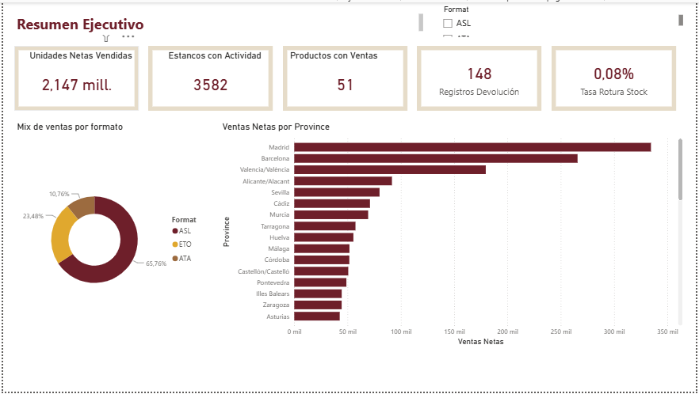

### Geografía y Renta

Dispersión de ventas por estanco frente a renta provincial (sin relación positiva clara, confirmando que la renta no explica el consumo), ranking de provincias por volumen (Madrid 334.576, Barcelona 265.726, Valencia/València 179.939...), y ventas por tipo de ubicación y tamaño de local — los estancos de tipo "ANY" y "VILLAGE" y los locales pequeños (5-20m²) concentran el grueso de la venta.

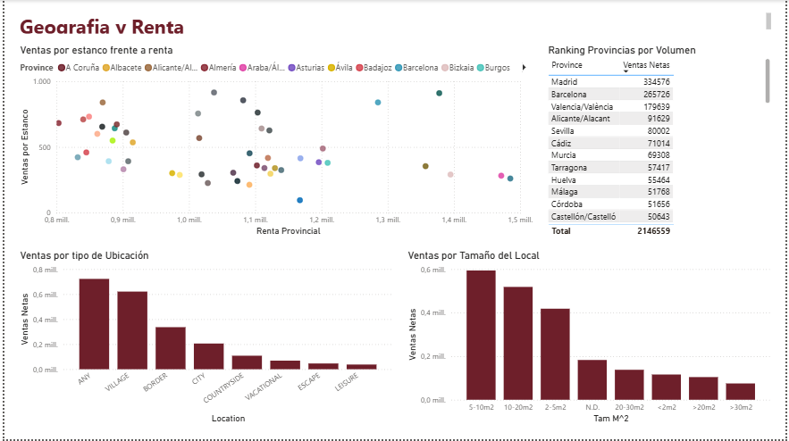

### Stock y Logística

Tasa de rotura de stock global (0,08%) y media de entrega (1,08), desglosadas por formato (ATA > ASL > ETO, confirmando la sobrerrepresentación del premium) y por provincia (Segovia, La Rioja y Toledo a la cabeza). El panel "Efecto de la ruta" es el más contundente: los outlets con ruta de reparto planificada tienen muchísimos más registros con entrega que los que no la tienen.

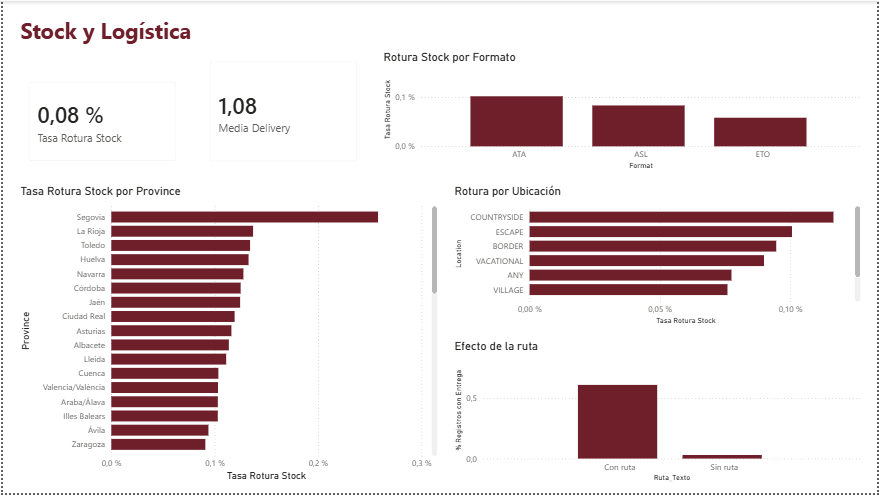

### Estacionalidad

Venta media por registro (2,05), % de ventas en fin de semana (19,0%) y diferencia festivo vs. laborable (-1,3%, confirmando que la venta es ligeramente menor en festivo). El patrón semanal es claro: pico los lunes y viernes, y el domingo se desploma tanto en volumen de venta como en reposición (la entrega prácticamente no opera en fin de semana).

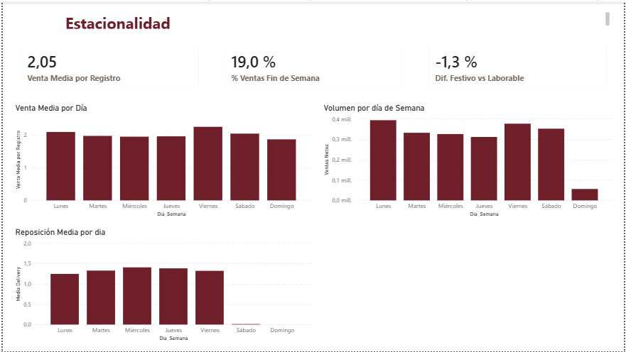

> El `.pbix` original también está disponible en [`dashboard/TFM_PBI.pbix`](dashboard/TFM_PBI.pbix) para explorarlo de forma interactiva con Power BI Desktop.

## Analítica avanzada

### Segmentación de outlets (clustering)

K-means (k=5) sobre 2.952 outlets, tras excluir 5 outliers con una tasa de rotura de stock 55-93 veces superior a la media. El número de clusters se justificó con el método del codo y el coeficiente de silueta.

<p float="left">
  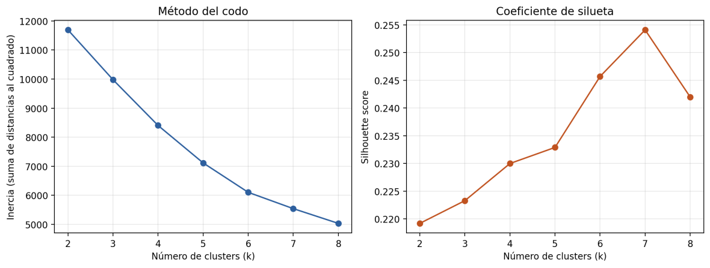
  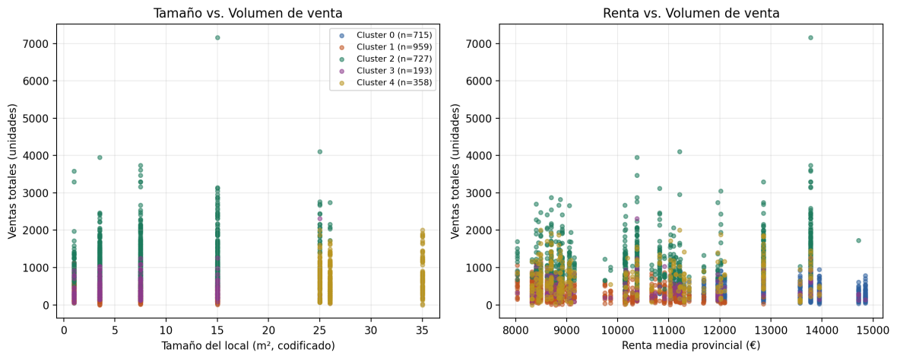
</p>

**Hallazgo principal:** el comportamiento de venta (volumen y diversidad de catálogo) segmenta la red con más claridad que variables puramente descriptivas como el tamaño del local o la renta provincial.

### Predicción de rotura de stock

Clasificación binaria (Regresión Logística, Árbol de Decisión, XGBoost) sobre 950.217 registros, con un desequilibrio extremo de clase (0,08% de casos positivos) tratado mediante balanceo de clases.

<p float="left">
  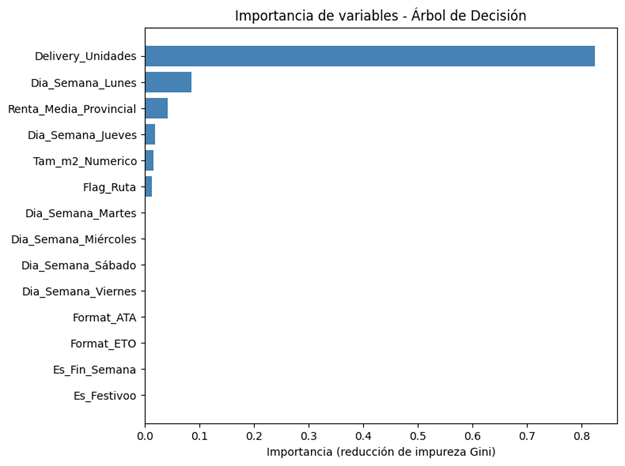
  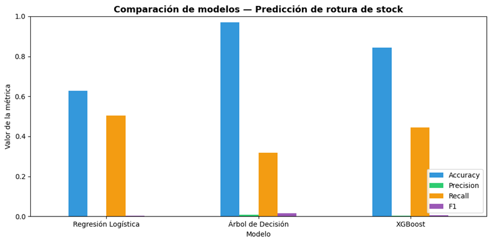
</p>

**Hallazgo principal:** `Delivery_Unidades` concentra el 82% de la capacidad predictiva del árbol de decisión — la rotura de stock en la red de Altadis es, fundamentalmente, un fenómeno logístico (falta de reposición), no de demanda ni de calendario.

## Principales hallazgos de negocio

- El negocio está fuertemente concentrado en el formato ASL (65,8% del volumen), con Madrid, Barcelona y Valencia liderando en ventas netas.
- La renta media neta por persona de la provincia **no** explica el comportamiento de venta por estanco — otros factores (densidad de población, turismo, hábitos locales) son más determinantes.
- El formato premium ATA está 3× sobrerrepresentado en roturas de stock respecto a su peso en volumen de ventas.
- La ruta de reparto planificada es el factor más explicativo de la regularidad de las entregas, por encima del formato o la ubicación del estanco.
- Patrón semanal robusto (pico lunes/viernes, mínimo domingo) y estacionalidad festiva contraintuitiva: la venta media es ligeramente *menor* en festivos que en laborables.

<p float="left">
  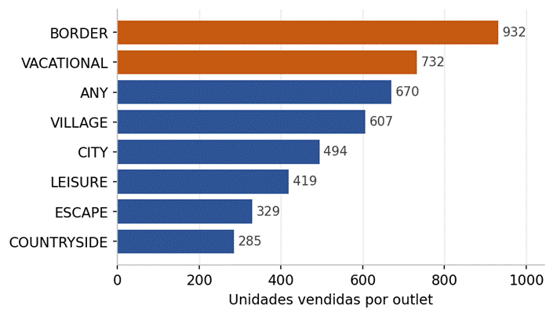
  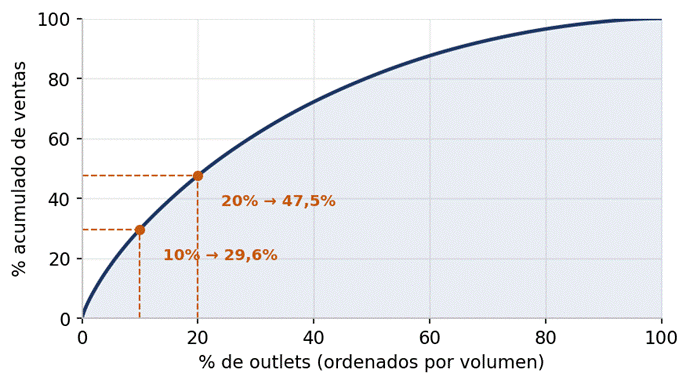
  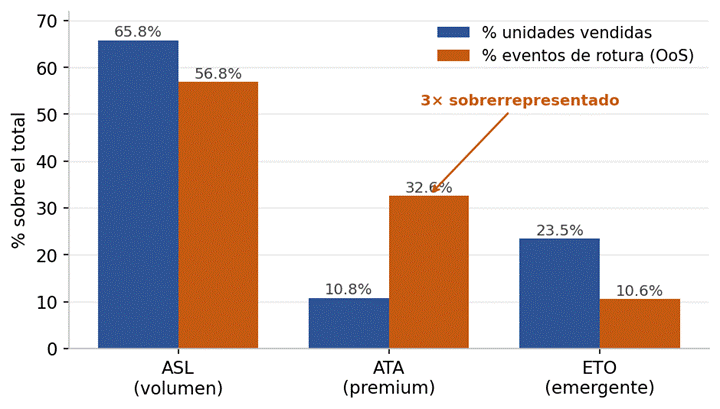
</p>

## Limitaciones (declaradas en la memoria)

- El fichero de ventas está truncado al límite de filas de Excel (1.048.575), acotando el análisis a la ventana del 9 de marzo al 6 de septiembre de 2015.
- Las cifras de rotura de stock son un límite inferior del fenómeno real: existe subnotificación por parte de los estancos.
- El desequilibrio extremo de la variable objetivo limita estructuralmente la precisión operativa de los modelos de clasificación.
- El 17,5% de los outlets no tiene dato de tamaño de local; se excluyeron del clustering en lugar de imputarse.
- El modelo de previsión de demanda (series temporales en R) quedó como línea de trabajo futura, no completada en el alcance de esta memoria.

## Stack técnico

- **SQL Server** — staging, limpieza, modelado dimensional y validación de integridad referencial.
- **Python** (pandas, scikit-learn, XGBoost, matplotlib) — EDA, clustering y modelos de clasificación.
- **Power BI** — cuadro de mando interactivo con DAX.
- **Fuentes externas:** INE (provincia y renta media neta por persona por provincia, a partir del código postal — [Atlas de distribución de renta de los hogares](https://www.ine.es/jaxiT3/Tabla.htm?t=53689)), BOE (calendario de festivos nacionales y autonómicos 2015 — [BOE-A-2014-10823](https://www.boe.es/boe/dias/2014/10/24/pdfs/BOE-A-2014-10823.pdf)).

## Memoria completa

El documento [`TFM_Final_CarlosBaztánPeiró.pdf`](TFM_Final_CarlosBaztánPeiró.pdf) recoge la metodología completa (CRISP-DM), la auditoría de calidad de datos, el diseño del Data Warehouse, el análisis exploratorio, los modelos predictivos y las conclusiones y recomendaciones para Altadis/Imperial Brands.
